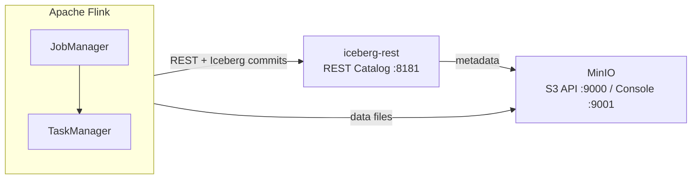

# Apache Iceberg on Apache Flink (local POC)

This document specifies the local proof of concept in this directory. For how we document research work (e.g. `notes.md` and `README.md` conventions), see the parent [AGENTS.md](../AGENTS.md).

## Goals

- Run Apache Flink 2.2 (Java 21) with Apache Iceberg 1.10.1 against a REST catalog and MinIO-backed warehouse, using the official iceberg-flink-quickstart Docker pattern.
- Prove end-to-end: create Iceberg catalog and `nyc.taxis` table, enable checkpointing, insert sample rows, query results from Flink SQL.
- Keep versions and Maven coordinates explicit and pinned for reproducibility.
- Document host port mappings so you can open Flink UI, MinIO console, and (optionally) probe the REST catalog from the host.

## Non-goals

- Production hardening (authn/z, TLS, HA JobManager, external metastore, governance).
- Benchmarking throughput or large-scale TPC-style datasets.
- Custom Iceberg build or non-Maven JAR supply chain.

## Deferred (out of scope for this POC)

| Topic | Notes |
| --- | --- |
| **MERGE / upserts** | Equality deletes and upsert flows are not required for the baseline insert/select path. |
| **Time travel** | `FOR SYSTEM_VERSION AS OF` (or equivalent) and historical reads are optional follow-ups, not acceptance criteria here. |
| **Streaming** | Continuous Iceberg source/sink beyond batch-style SQL in the quickstart is optional. |
| **Non-Docker** | Bare-metal or Kubernetes deployment is not covered. |

## Pinned stack

| Component | Version / image | Notes |
| --- | --- | --- |
| **Apache Flink** | `2.0` (base image `apache/flink:2.0-java21`) | JobManager + TaskManager from same build. |
| **Java** | **21** | Per Flink image. |
| **Apache Iceberg** | **1.10.1** | JARs installed in the custom image. |
| **iceberg-flink-runtime** | `org.apache.iceberg:iceberg-flink-runtime-2.0:1.10.1` | [Maven Central](https://repo.maven.apache.org/maven2/org/apache/iceberg/iceberg-flink-runtime-2.0/1.10.1/) |
| **iceberg-aws-bundle** | `org.apache.iceberg:iceberg-aws-bundle:1.10.1` | S3 / MinIO file I/O. |
| **Hadoop (client API + runtime)** | `3.4.2` | `hadoop-client-api`, `hadoop-client-runtime` for Hadoop FS wiring. |
| **Iceberg REST fixture** | `apache/iceberg-rest-fixture` (latest tag as pulled) | In-container REST catalog for dev. |
| **MinIO** | `minio/minio` + `minio/mc` | S3-compatible object storage; API and console ports published to the host. |

## Environment contract

- **Host**: Docker (Desktop or engine) with enough disk for images and the `warehouse` bucket.
- **Compose project directory**: this folder (contains `Dockerfile`, `docker-compose.yml`, and `sql/`).
- **Container network DNS**: `jobmanager`, `iceberg-rest`, `minio` resolve on `iceberg_net` (per compose file).
- **S3 / MinIO**: Warehouse URI `s3://warehouse/`; access key `admin`, secret `password`, path-style access; endpoint inside the stack: `http://minio:9000`.
- **REST catalog (Flink)**: `http://iceberg-rest:8181` from JobManager / TaskManager.
- **Credentials**: Same `AWS_ACCESS_KEY_ID` / `AWS_SECRET_ACCESS_KEY` / `AWS_REGION` as in the quickstart `docker-compose` (for Flink and MinIO alignment).

## Architecture (logical)

Flink runs SQL, talks to the Iceberg REST catalog for table metadata, and reads/writes object data via S3-compatible storage (MinIO).

## Scenarios and acceptance

| # | Scenario | Accept when |
| --- | --- | --- |
| 1 | **Catalog** | `CREATE CATALOG` with REST + `s3://warehouse/` + MinIO endpoint succeeds. |
| 2 | **Database & table** | `CREATE DATABASE nyc` and `CREATE TABLE ... taxis` under `iceberg_catalog` succeed. |
| 3 | **Checkpointing** | `SET 'execution.checkpointing.interval' = '10s'` applies (required for Iceberg writes). |
| 4 | **Insert** | `INSERT` of four sample rows completes without error. |
| 5 | **Select** | `SELECT *` returns four rows (optionally with `tableau` result mode). |
| 6 | (Optional) | Metadata tables e.g. `` `taxis$snapshots` `` queryable. |
| 7 | (Optional) | Second script with inline Iceberg connector `CREATE TABLE taxis_inline` runs. |
| 8 | (Deferred) | Time travel / streaming not required for “green” baseline. |

## Risks and mitigations

| Risk | Mitigation |
| --- | --- |
| **Version skew** (Flink vs Iceberg runtime JAR) | Keep `iceberg-flink-runtime-2.0` aligned with Flink major; pin `ICEBERG_VERSION` in `Dockerfile` and document in this SPEC. |
| **Apple Silicon** | Prefer published multi-arch images (Flink, MinIO); if a component is `amd64`-only, use Docker’s QEMU or an Intel host and note in `notes.md`. |
| **Checkpoints & commits** | Always set a checkpoint interval before writes; if jobs fail, check JobManager logs and that MinIO/REST are healthy. |
| **Port conflicts** | Host ports **8081**, **8181**, **9000**, **9001** are published; change locally if in use. |

## Deliverables

- `Dockerfile` — matches upstream [iceberg-flink-quickstart](https://github.com/apache/iceberg/tree/main/docker/iceberg-flink-quickstart) (Iceberg + Hadoop JARs on Flink).
- `docker-compose.yml` — same services as upstream with published ports for local use.
- `sql/01_nyc_taxis.sql` — main REST catalog flow (and optional commented metadata).
- `sql/02_optional_inline_table.sql` — inline Iceberg connector table example.
- `README.md` — how to run, links, limitations.
- `notes.md` — session log template (per [AGENTS.md](../AGENTS.md)).
- `SPEC.md` — this file.
