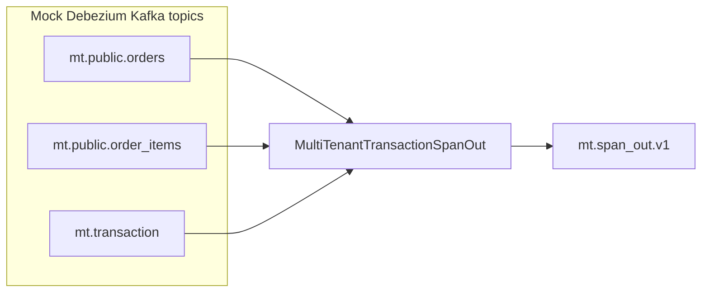

# Multi-tenant Debezium span-out PTF research

## Problem Statement

Source database is multi tenants within same tables. The problem is to fan-out content to multiple tables, one per tenant, but keep consistency on the create records. As an example we use orders and order_items per tenant:


The architecture leverage Kafka and Flink to implement the medallion architecture:


In modern architecture, [Debezium CDC](https://debezium.io/documentation/reference/stable/connectors/postgresql.html) is used to inject table rows into Kafka topic as records. Committed rows are injected to Kafka topic. The pattern is to have one topic per source SQL table.

Debezium may be able to generate events with transaction boundaries and enriches change event envelopes with [transaction metadata](https://debezium.io/documentation/reference/stable/connectors/postgresql.html#postgresql-transaction-metadata). 

The data message Envelope is enriched with a new transaction field which includes information about the transaction id, and the current event position  among all events generated by the transaction, and per data collection.


## Context

This research implementation leverages Flink 2.2 `ProcessTableFunction` to fans out completed Debezium database transactions from shared multi-tenant CDC tables into per-collection rows tagged with `tenant_id`.

Many input streams → multiple output rows per transaction instead of one denormalized row.

See [SPEC.md](SPEC.md) for goals and acceptance criteria.

## Architecture



| Input | Role |
| --- | --- |
| `orders_cdc` | Shared `orders` table CDC with `tenant_id` |
| `order_items_cdc` | Shared `order_items` CDC |
| `transaction_events` | Debezium BEGIN/END; END `event_count` drives completion |

On completion the PTF emits:

- One row with `target_collection = orders` (header fields).
- One row per line item with `target_collection = order_items`.

Route to per-tenant sinks with SQL, for example:

```sql
INSERT INTO acme_orders_out
SELECT transaction_id, order_id, status, total_amount
FROM span_out_view
WHERE tenant_id = 'acme' AND target_collection = 'orders';
```

## Comparison with DebeziumTransactionDenormalizer

| | Denormalizer (ptf-examples) | This research |
| --- | --- | --- |
| Direction | Many tables → one row | One transaction → many rows |
| Tenant | N/A | `tenant_id` on every emit |
| Completion | END `event_count` | Same pattern |
| Output | `DenormalizedTransaction` + `line_items[]` | Flat `SpanOutEvent` per target |

## Project layout

| Path | Description |
| --- | --- |
| [ptf/](ptf/) | Maven module: `MultiTenantTransactionSpanOut` + unit tests |
| [test-data/debezium/](test-data/debezium/) | NDJSON fixtures (tenants `acme`, `globex`) |
| [src/mt_spanout_kafka/](src/mt_spanout_kafka/) | `debezium-mock-produce` CLI |
| [flink/sql/](flink/sql/) | DDL, PTF registration, DML |
| [docker-compose.yaml](docker-compose.yaml) | CP Kafka 8.2 + Flink 2.2 |

## Quick start (local)

### Prerequisites

- Java 11+, Maven 3.8+
- Docker + Docker Compose
- [uv](https://github.com/astral-sh/uv) for the mock producer

### Unit tests (no cluster)

```bash
mvn -f ptf/pom.xml test
uv sync --extra dev
uv run pytest
```

### End-to-end demo

```bash
chmod +x scripts/run_demo.sh
./scripts/run_demo.sh
```

This builds the PTF JAR, starts Kafka + Flink, publishes mock CDC, and runs the filesystem SQL batch in `flink/sql/07_filesystem_demo.sql`.

Manual Kafka path:

```bash
mvn -f ptf/pom.xml package
docker compose build && docker compose up -d
KAFKA_BOOTSTRAP_SERVERS=127.0.0.1:9092 uv run debezium-mock-produce
docker compose exec sql-client bin/sql-client.sh -f /opt/flink/sql/00_run_all.local.sql
# Then start streaming insert:
docker compose exec sql-client bin/sql-client.sh -f /opt/flink/sql/06_dml_span_out.sql
```

Verify sink topic:

```bash
docker compose exec broker kafka-console-consumer \
  --bootstrap-server broker:29092 \
  --topic mt.span_out.v1 \
  --from-beginning --max-messages 10
```

### Expected output (acme transaction `12345:98765432`)

| tenant_id | target_collection | order_id | notes |
| --- | --- | --- | --- |
| acme | orders | 1001 | status `confirmed` after UPDATE |
| acme | order_items | 1001 | product 777 |
| acme | order_items | 1001 | product 888 |

Globex transaction `67890:11111111` yields 2 rows (1 orders + 1 line item).

## Confluent Cloud Flink

Requires a Flink 2.2+ compute pool with ProcessTableFunction support (not legacy UDTF-only pools).

### 1. Build and upload artifact

```bash
mvn -f ptf/pom.xml package
confluent flink artifact create multitenant-spanout \
  --artifact-file ptf/target/multitenant-debezium-spanout-0.1.0.jar \
  --cloud "$CLOUD_PROVIDER" \
  --region "$CLOUD_REGION" \
  --environment "$ENV_ID"
```

Note the artifact id and version id from the CLI or Console.

### 2. Register the PTF

In the Flink SQL workspace:

```sql
CREATE FUNCTION MultiTenantTransactionSpanOut
  AS 'com.research.ptf.multitenant.MultiTenantTransactionSpanOut'
  USING JAR 'confluent-artifact://<artifact-id>/<version-id>';
```

### 3. Kafka tables

Run [flink/sql/01_ddl_orders_cdc.sql](flink/sql/01_ddl_orders_cdc.sql) through [06_dml_span_out.sql](flink/sql/06_dml_span_out.sql), replacing `${BOOTSTRAP_SERVERS}` with your cluster bootstrap. For SASL_SSL add to each `WITH` clause:

```sql
'properties.security.protocol' = 'SASL_SSL',
'properties.sasl.mechanism' = 'PLAIN',
'properties.sasl.jaas.config' = 'org.apache.kafka.common.security.plain.PlainLoginModule required username="..." password="...";'
```

### 4. Publish mock data

Copy [.env.example](.env.example) to `.env`, set Confluent Cloud Kafka credentials, then:

```bash
uv run debezium-mock-produce
```

### 5. Start streaming job

Execute `06_dml_span_out.sql` and monitor `mt.span_out.v1` in the Cloud Console.

## PTF usage (SQL)

```sql
CREATE FUNCTION MultiTenantTransactionSpanOut
  AS 'com.research.ptf.multitenant.MultiTenantTransactionSpanOut';

SELECT transaction_id, tenant_id, target_collection, order_id, status, total_amount, product_id
FROM MultiTenantTransactionSpanOut(
    ordersEvent => TABLE orders_cdc PARTITION BY transaction_id,
    orderItemsEvent => TABLE order_items_cdc PARTITION BY transaction_id,
    transactionEvent => TABLE transaction_events PARTITION BY id,
    uid => 'multitenant-spanout-v1'
);
```

## References

- [flink-ptf-examples / DebeziumTransactionDenormalizer](https://github.com/jbcodeforce/flink-ptf-examples)
- [Confluent Cloud: CREATE FUNCTION with artifacts](https://docs.confluent.io/cloud/current/flink/reference/statements/create-function.html)
- [Flink 2.2 Process Table Functions](https://nightlies.apache.org/flink/flink-docs-release-2.2/docs/dev/table/functions/ptfs/)
