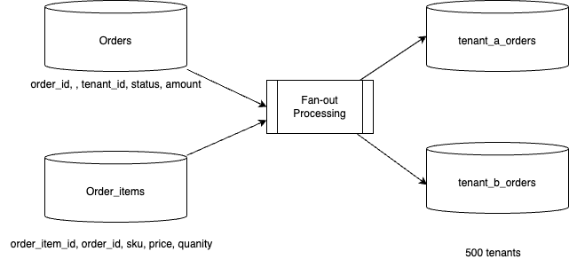
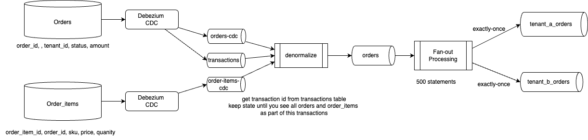
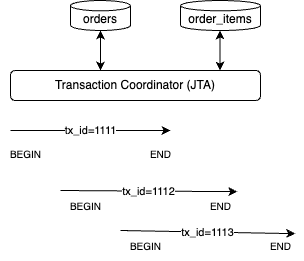

# Multi-tenant Debezium denormalizer PTF research

## Problem Statement

The source architecture include d Databases with t tables each. Debezium CDC inject data to topics from those database. The architecture decision is to use Debezium into just 3 Kafka topics (DML, DDL, and Transactions). Debezium creates a topic for every single table. To collapse them into three global topics, you must combine Kafka Connect Single Message Transformations (SMTs) for routing with a Subject Name Strategy that prevents schema conflicts. Using a single DML topic using Kafka's default TopicNameStrategy, the Schema Registry will immediately reject the messages due to schema backward-incompatibility. Confluent has the `io.confluent.kafka.serializers.subject.TopicRecordNamingStrategy`, where the Schema Registry registers schemas based on a combination of the Topic Name and the Fully Qualified Record Name (e.g., global-dml-topic-server.database.table.Value). This allows thousands of structurally unique table schemas to coexist peacefully within the exact same Kafka topic.

```sh
value.converter=io.confluent.connect.avro.AvroConverter
value.converter.schema.registry.url=http://localhost:8081
value.converter.value.subject.name.strategy=io.confluent.kafka.serializers.subject.TopicRecordNamingStrategy
```

* The DML Topic (Data Changes): Debezium automatically emits row-level changes to topics named <topic.prefix>.<database>.<table_name>. We can intercept anything matching this pattern and force it into global-dml-topic.
* The DDL Topic (Schema Changes): Debezium captures schema changes and writes them to a topic named exactly after the <topic.prefix>. We will route these to global-ddl-topic.
* The Transaction Topic (DB Transactions): By setting provide.transaction.metadata=true, Debezium emits transaction boundaries to <topic.prefix>.transaction. We will route these to global-tx-topic.

Here is an example of potential Kafka Connector config:

```sh
# --- Basic Connector Config ---
connector.class=io.debezium.connector.mysql.MySqlConnector
tasks.max=1
topic.prefix=cdc_deploy_01

# --- Enable Transaction Metadata ---
provide.transaction.metadata=true

# --- SMT Routing Configuration ---
transforms=routeDML,routeTX,routeDDL

# 1. Route Transactions (.transaction suffix)
transforms.routeTX.type=org.apache.kafka.connect.transforms.RegexRouter
transforms.routeTX.regex=^cdc_deploy_01\\.transaction$
transforms.routeTX.replacement=global-tx-topic

# 2. Route DML (Matches prefix.database.table, ignores transaction)
# This regex looks for two distinct namespace dots after the prefix
transforms.routeDML.type=org.apache.kafka.connect.transforms.RegexRouter
transforms.routeDML.regex=^cdc_deploy_01\\.(?!transaction)([^.]+)\\.([^.]+)$
transforms.routeDML.replacement=global-dml-topic

# 3. Route DDL (Matches the bare topic prefix where schema changes go)
transforms.routeDDL.type=org.apache.kafka.connect.transforms.RegexRouter
transforms.routeDDL.regex=^cdc_deploy_01$
transforms.routeDDL.replacement=global-ddl-topic
```

If the number of database and tables grow, do not use one kafka connector, but multiple of them and configure `database.include.list` or `table.include.list`. Always measure the JVM heap of the connector.

Tune the number of partitions for the DML topic.

### Flink requirements 
The problem is to fan-out the records to multiple tables, one per tenant, but keep consistency on the create records. As an example we use orders and order_items per tenant:



The architecture leverage Kafka and Flink to implement the medallion architecture:




In modern architecture, [Debezium CDC](https://debezium.io/documentation/reference/stable/connectors/postgresql.html) is used to inject table rows into Kafka topic as records. Committed rows are injected to Kafka topic. The pattern is to have one topic per source SQL table.

Debezium may be able to generate events with transaction boundaries and enriches change event envelopes with [transaction metadata](https://debezium.io/documentation/reference/stable/connectors/postgresql.html#postgresql-transaction-metadata). 

| Input | Role |
| --- | --- |
| `orders_cdc` | Shared `orders` table CDC with `tenant_id` |
| `order_items_cdc` | Shared `order_items` CDC |
| `transaction_events` | Debezium BEGIN/END; END `event_count` drives completion |

The data message Envelope is enriched with a new transaction field which includes information about the transaction id, and the current event position  among all events generated by the transaction, and per data collection.



Examples of transactions data

```json
{"status":"BEGIN","id":"12345:98765432","ts_ms":1718294400123,"event_count":null,"data_collections":null}
{"status":"END","id":"12345:98765432","ts_ms":1718294400230,"event_count":3,"data_collections":[{"data_collection":"public.orders","event_count":1},{"data_collection":"public.order_items","event_count":2}]}

```

Finally it is important to note that Flink kafka sink connector, is a kafka producer and to ensure exactly once delivery, it uses transaction:

* The lifecycle of a Kafka transaction is managed by a broker acting as the Transaction Coordinator. A transaction is considered committed through a multi-phase process triggered when the producer calls producer.commitTransaction():
    * The Intent to Commit: The producer sends an EndTxnRequest to the Transaction Coordinator indicating it wants to commit.
    * Phase 1: Prepare Commit: The Transaction Coordinator writes a PrepareCommit message to its internal `__transaction_state` log. This is the point of no return. Once this log entry is appended, the transaction is guaranteed to succeed, even if the coordinator crashes right after.
    * Phase 2: Writing Markers (The actual commit): The Coordinator writes a special, non-data message called a Commit Marker (or Control Batch) to every topic-partition that was involved in the transaction.
    * Phase 3: Complete Commit: After all markers are successfully written to the respective partition leaders, the Coordinator writes a CompleteCommit message to its __transaction_state log, closing the transaction.
* The record is visible to the consumer once the Commit Markers are written to the actual data partitions
* By default, Kafka consumers operate in read_uncommitted mode, meaning they see all messages. When the consumer configuration to `isolation.level=read_committed`, the consumer filters out uncommitted data:
    * the consumer is strictly blocked from reading past the Last Stable Offset (LSO). The LSO is defined as the offset of the first ongoing (uncommitted) transaction in that partition.
    * If there are no active transactions, the LSO is equal to the High Watermark (HW) (the last replicated offset across ISRs).
    * Even if non-transactional messages or messages from a later transaction are written to the log, the consumer cannot read them until the oldest active transaction is either committed or aborted, moving the LSO forward.
* As the consumer reads up to the LSO, it encounters a mix of transactional data, non-transactional data, and markers:
    * Non-transactional messages: Delivered to the application immediately.
    * Transactional messages: The consumer buffers these messages in memory, tracking them by their Producer ID (PID). It will not return them to the client application yet.
    * Encountering a Commit Marker: The consumer realizes the transaction for that PID succeeded. It releases the buffered messages to the application.
    * Encountering an Abort Marker: The consumer realizes the transaction failed. It silently drops/discards the buffered messages for that PID, and the application never sees them.

## Context

This research implementation leverages Flink 2.2 `ProcessTableFunction` to keep Debezium database transaction state and emit one denormalized order row per transaction (header + `line_items` array), then route by `tenant_id` to per-tenant order tables.

### Inputs

* Debezium CDC transactions

```sql
CREATE TABLE `db.transaction_events` (
    status STRING,
    id STRING,
    ts_ms BIGINT,
    event_count BIGINT,
    data_collections ARRAY<ROW<data_collection STRING, event_count BIGINT>>
) WITH
```

* Orders (CDC envelop not represented)
```sql
id BIGINT,
tenant_id STRING,
customer_id BIGINT,
status STRING,
total_amount DOUBLE
```

* Order_items

```sql
CREATE TABLE order_items_cdc (
    `before` ROW<
        id BIGINT,
        tenant_id STRING,
        order_id BIGINT,
        product_id BIGINT,
        quantity INT,
        unit_price DOUBLE>,
    `after` ROW<
        id BIGINT,
        tenant_id STRING,
        order_id BIGINT,
        product_id BIGINT,
        quantity INT,
        unit_price DOUBLE>,
    `source` ROW<
        version STRING,
        connector STRING,
        name STRING,
        ts_ms BIGINT,
        db STRING,
        `schema` STRING,
        `table` STRING,
        txId BIGINT,
        lsn BIGINT,
        xmin BIGINT>,
    op STRING,
    ts_ms BIGINT,
    `transaction` ROW<id STRING, total_order BIGINT, data_collection_order BIGINT>,
    transaction_id AS `transaction`.id
);
```

## Architecture

On completion the PTF emits one denormalized order row per transaction (same as `DebeziumTransactionDenormalizer`), with nested `line_items` matching [sql/cc-flink/04_ddl_orders.sql](sql/cc-flink/04_ddl_orders.sql) structure.

The State to keep in Flink as part of the Process Table Function is the transaction event, which keeps transaction event counters ( `expectedEventCount, receivedEventCount, endEventReceived`) and the attributes for the order to generate as output of the function:

```java
  public static class TransactionState {
    public String tenantId;
    public Long orderId;
    public Long customerId;
    public String status;
    public Double totalAmount;
    public Integer expectedEventCount;
    public int receivedEventCount;
    public boolean endEventReceived;
    public final java.util.List<LineItem> lineItems = new java.util.ArrayList<>();
  }
```

The state is kept in checkpoints, and for a duration of 1 hour. See the eval function, with parameter's hints.

```java
  public void eval(
      Context ctx,
      @StateHint(ttl = "1 hour") TransactionState state,
```

The PTF implementation logic is:

* when there is a transaction event, assess if this is a END status, then update the State with expectedEventCount. 
* When there is an order event, update the transaction state with order data where the transaction id in the metadata matches the transaction id of the transaction event. Update the received event counter. 
* Same logic to order_items events
* When the transaction is completed and the expected number of events = received event counter then generate the output as a denormalized order. 


### Route to per-tenant physical tables with SQL:

```sql
INSERT INTO acme_orders
SELECT transaction_id, order_id, customer_id, status, total_amount, line_items
FROM orders
WHERE tenant_id = 'acme';
```

## Deployments

### Prerequisites

- Java 11+, Maven 3.8+
- Docker + Docker Compose for local deployment
- [uv](https://github.com/astral-sh/uv) for the mock producer

### Unit tests (no cluster)

```bash
mvn -f ptf/pom.xml test
```


### Quick start (Confluent Cloud)

* build the PTF JAR:
  ```sh
  mvn package
  ```

* In Confluent Cloud flink Workspace execute the DDLs:
  * 01_ddl_order_cdc.sql
  * 02_ddl_order_items_cdc.sql
  * 03_ddl_transaction_events.sql
  * 04_ddl_orders.sql

* Upload the PTF JAR via Confluent Console > Artifacts > Add artifact: be sure to select the Cloud provider and region matching Flink workspace location.

* Create a function
  ```sql
  CREATE FUNCTION  MultiTenantTransactionDenormalizer
  AS 'com.research.ptf.multitenant.MultiTenantTransactionDenormalizer'
  USING JAR 'confluent-artifact://cfa-7z2nn1';
  ```

  or using cli:
  ```
  confluent flink artifact create multitenant-denormalizer \
  --artifact-file ptf/target/multitenant-debezium-spanout-0.1.0.jar \
   --cloud aws --region us-west-2 --environment env-
  ```

* Deploy the SQL that use the PTF. See file []()
  ```
  ```
* The simplified version is to remove the envelop and deduplicate within CTE and joins order_items and orders. See [07_dml_denormalized_orders.sq](./sql/cc-flink/07_dml_denormalized_orders.sql)


#### Clean up

* Drop tables:
  ```sql
  DROP TABLE mt_orders
  ```

* Drop function
  ```sql
  drop function MultiTenantTransactionDenormalizer;
  ```

* Delete Artifact


#### dbt deployment to scale the static routing

Generate per-tenant routing DML from `mt_orders` using dbt + Jinja in `sql/order_pipeline`.

```bash
cd sql/order_pipeline

# 1) Load tenant registry
dbt seed --select tenant_routes

# 2) Build SQL artifact table with one rendered statement per tenant
dbt run --select routing.tenant_route_dml

# 3) Print generated DML statements
dbt run-operation run_tenant_route_dml

# 4) Execute generated DML statements in the target engine
dbt run-operation run_tenant_route_dml --args '{"execute_statements": true}'

# Optional: execute only one tenant
dbt run-operation run_tenant_route_dml --args '{"tenant_id": "acme", "execute_statements": true}'
```

The tenant list is managed in `sql/order_pipeline/seeds/tenant_routes.csv` (`tenant_id`, optional `target_table` override).  
If `target_table` is empty, dbt defaults to `mt_<tenant>_orders`.

### Quick start (local)

!!! To be continued

```bash
chmod +x scripts/run_demo.sh
./scripts/run_demo.sh
```

This builds the PTF JAR, starts Kafka + Flink, publishes mock CDC, and runs the filesystem SQL batch in `flink/sql/07_filesystem_demo.sql`.

Manual Kafka path:

```bash
mvn -f ptf/pom.xml package
docker compose build && docker compose up -d
KAFKA_BOOTSTRAP_SERVERS=127.0.0.1:9092 uv run debezium-mock-produce
docker compose exec sql-client bin/sql-client.sh -f /opt/flink/sql/00_run_all.local.sql
# Then start streaming insert:
docker compose exec sql-client bin/sql-client.sh -f /opt/flink/sql/06_dml_denormalized_orders.sql
```

Verify sink topic:

```bash
docker compose exec broker kafka-console-consumer \
  --bootstrap-server broker:29092 \
  --topic mt.orders.denormalized.v1 \
  --from-beginning --max-messages 10
```

### Expected output (acme transaction `12345:98765432`)

One row: `tenant_id=acme`, `order_id=1001`, `status=confirmed`, `line_items` length 2 (products 777 and 888).

Globex transaction `67890:11111111` yields one row with one line item.

## Confluent Cloud Flink

Requires a Flink 2.2+ compute pool with ProcessTableFunction support (not legacy UDTF-only pools).

### 1. Build and upload artifact

```bash
mvn -f ptf/pom.xml package
confluent flink artifact create multitenant-spanout \
  --artifact-file ptf/target/multitenant-debezium-spanout-0.1.0.jar \
  --cloud "$CLOUD_PROVIDER" \
  --region "$CLOUD_REGION" \
  --environment "$ENV_ID"
```

Note the artifact id and version id from the CLI or Console.

### 2. Register the PTF

In the Flink SQL workspace:

```sql
CREATE FUNCTION MultiTenantTransactionDenormalizer
  AS 'com.research.ptf.multitenant.MultiTenantTransactionDenormalizer'
  USING JAR 'confluent-artifact://<artifact-id>/<version-id>';
```

### 3. Kafka tables

Run [sql/cc-flink/](sql/cc-flink/) DDL scripts (or [sql/flink/](sql/flink/) for local), then [07_dml_denormalized_orders.sql](sql/cc-flink/07_dml_denormalized_orders.sql). For SASL_SSL add to each `WITH` clause:

```sql
'properties.security.protocol' = 'SASL_SSL',
'properties.sasl.mechanism' = 'PLAIN',
'properties.sasl.jaas.config' = 'org.apache.kafka.common.security.plain.PlainLoginModule required username="..." password="...";'
```

### 4. Publish mock data

Copy [.env.example](.env.example) to `.env`, set Confluent Cloud Kafka credentials, then:

```bash
uv run debezium-mock-produce
```

### 5. Start streaming job

Execute `07_dml_denormalized_orders.sql` and monitor the denormalized orders topic in the Cloud Console.

## PTF usage (SQL)

```sql
CREATE FUNCTION MultiTenantTransactionDenormalizer
  AS 'com.research.ptf.multitenant.MultiTenantTransactionDenormalizer';

SELECT transaction_id, tenant_id, order_id, customer_id, status, total_amount,
       CARDINALITY(line_items) AS num_line_items
FROM MultiTenantTransactionDenormalizer(
    ordersEvent => TABLE orders_cdc PARTITION BY transaction_id,
    orderItemsEvent => TABLE order_items_cdc PARTITION BY transaction_id,
    transactionEvent => TABLE transaction_events PARTITION BY id,
    uid => 'multitenant-denormalizer-v1'
);
```

## References

- [flink-ptf-examples / DebeziumTransactionDenormalizer](https://github.com/jbcodeforce/flink-ptf-examples)
- [Confluent Cloud: CREATE FUNCTION with artifacts](https://docs.confluent.io/cloud/current/flink/reference/statements/create-function.html)
- [Flink 2.2 Process Table Functions](https://nightlies.apache.org/flink/flink-docs-release-2.2/docs/dev/table/functions/ptfs/)
