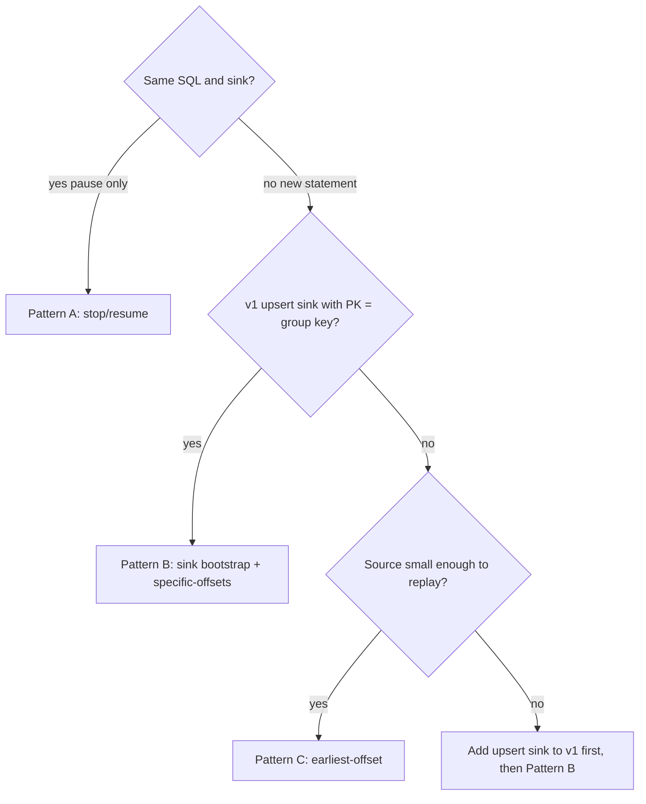

# Patterns: state handoff for Flink SQL aggregations

Decision guide for stopping a stateful aggregation and continuing processing without full source replay on Confluent Cloud.

## Confluent Cloud: savepoints are not user-accessible

End users on Confluent Cloud for Flink cannot list, trigger, export, or restore savepoints. Savepoints are used internally by Confluent engineers during product version-to-version migration. You cannot rely on savepoints as a user-operable migration or DR mechanism.

What users do have:

- Stop/resume on the same statement (platform-managed internal state; opaque to the user).
- `status.latest_offsets` on a stopped statement (for offset hints).
- Carry-over offsets (stateless statements only).
- Externalized state via Kafka topics (upsert sink bootstrap — this study).

When replacing a statement with new SQL or a new sink, sink-topic bootstrap (Pattern B) is the practical user-controlled path.

## Problem

Global keyed aggregations (`GROUP BY key`, `SUM`, `COUNT`) hold state in Flink. When you need a new statement (different SQL, new sink topic, or incompatible graph change), CC carry-over offsets and materialized-table evolution do not preserve aggregation state.

| Mechanism | Preserves agg state? | Changes SQL/sink? | User-controlled? |
|-----------|---------------------|-------------------|------------------|
| Stop/resume same statement | Yes (opaque platform state) | No | Partial (stop/resume only) |
| Savepoint (user API) | N/A on CC | — | No — not exposed |
| Carry-over offsets | No (stateless only) | Yes | Yes |
| CREATE OR ALTER MATERIALIZED TABLE | No (reprocess source) | Yes | Yes |
| Sink-topic bootstrap (this study) | Yes (via upsert topic) | Yes | Yes |

## Pattern A — Stop/resume same statement (pause only, no replacement)

Use when you only need to pause the same query — not when deploying a new statement, sink, or SQL shape.

```
stop handoff-dml-v1  →  platform preserves internal state (not user-visible savepoint)
resume handoff-dml-v1  →  same statement continues
```

Pros: no bootstrap cost; same statement and sink.

Cons: CC SQL is immutable per statement — cannot change DML or output topic; not a replacement strategy; no user access to underlying savepoint artifacts.

## Pattern B — Sink-topic bootstrap + specific-offsets (this study)

Primary end-user path when v1 already writes upsert changelog keyed by group key, and v2 is a new statement writing to a new sink.

```
v1: source → GROUP BY → agg_sink_v1 (upsert, PK = group key)
stop v1, record status.latest_offsets on source
v2: agg_snapshot (read sink_v1 earliest) FULL OUTER JOIN incremental source (specific-offsets) → agg_sink_v2
```

### Why two inputs?

- Snapshot replays compacted upsert topic to recover per-key totals without re-reading the full source history.
- Source uses `specific-offsets` from v1 stop so only post-stop events are aggregated incrementally.
- Merge adds `snapshot.total + incremental.delta` per key.
- User owns the handoff via Kafka topic data and offset hints — no savepoint required.

### Primary SQL (06)

```sql
-- incremental subquery: new events only
-- FULL OUTER JOIN: keys with no new events still appear from snapshot
COALESCE(snap.total_amount, 0) + COALESCE(inc.delta, 0)
```

### Fallback SQL (06b)

If FULL OUTER JOIN is rejected or behaves incorrectly on CC:

```sql
-- UNION ALL: one seed row per key (prior total) + new raw events
-- GROUP BY SUM — valid only when specific-offsets excludes already-counted events
SELECT device_id, SUM(amount), MAX(event_time)
FROM (
  SELECT device_id, total_amount AS amount, last_event_time AS event_time FROM agg_snapshot
  UNION ALL
  SELECT device_id, amount, event_time FROM device_events /* specific-offsets */
) GROUP BY device_id
```

## Pattern C — Full source replay (baseline, avoid)

```
v2 source: scan.startup.mode = earliest-offset
```

Reprocesses entire source through aggregation. Correct but expensive for large retained history. Materialized-table `FROM_BEGINNING` evolution uses this path when internal platform resume is unavailable or the query change is incompatible.

## Cost comparison

| Cost | Stop/resume (same stmt) | Sink bootstrap | Full replay |
|------|-------------------------|----------------|-------------|
| Source bytes read | From stop offset | From stop offset | All retained |
| Sink/bootstrap bytes | None | All keys in agg-state-v1 | None |
| Flink state rebuild | Opaque platform restore | ChangelogNormalize on snapshot + new agg | Full GROUP BY state |
| User operability | Stop/resume API only | Topic + offsets | SQL startup mode |

Sink bootstrap trades source replay for sink topic replay. Worth it when source retention >> compacted sink size (many raw events per key).

## Semantics caveats

- Cross-statement handoff is at-least-once unless you validate offset boundaries and idempotent upsert sinks.
- SUM/COUNT compose with `prior + delta`. AVG needs count+sum merge; MIN/MAX need different logic.
- Windowed aggregates need window-end state, not just per-key totals — out of scope.
- Upsert sink must use primary key = group-by key so replay yields one row per key.

## When to choose


