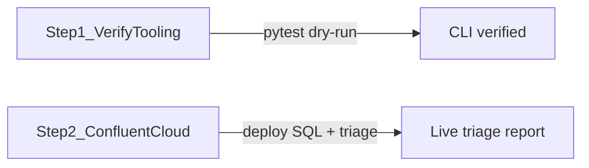

# Deployment guide — Confluent Cloud only

All Flink SQL runs on **Confluent Cloud for Flink**; `flink-triage` uses CC Flink REST and the Metrics API.



| Step | Target | Script |
|------|--------|--------|
| 1 | Local / CI (no Flink cluster) | `./assets/scripts/step1_verify.sh` |
| 2 | Confluent Cloud for Flink | `./assets/scripts/step2_deploy_cc.sh` |

Debug SQL: [`assets/cc-flink/`](../cc-flink/) (from [flink-studies perf-testing](https://github.com/jbcodeforce/flink-studies/tree/master/e2e-demos/perf-testing)).

---

## Step 1 — Verify tooling (no cluster)

Confirms `flink-triage` CLI, tests, and report generation using fixture data.

```bash
cd flink-statement-troubleshooting
uv sync --extra dev
./assets/scripts/step1_verify.sh
```

Expected: pytest passes, dry-run report in `examples/sample_triage_report.md`.

This step does not start or require any Flink runtime.

---

## Step 2 — Confluent Cloud for Flink

Deploy statements and run live triage against Confluent Cloud.

### Prerequisites

- Confluent CLI (`confluent login`)
- Flink 2.2+ compute pool on Confluent Cloud
- API keys: Flink (regional), Metrics/Telemetry, Kafka cluster (SASL_SSL)
- Topics `perf-input` and `perf-output` on your CC Kafka cluster

### Configure

```bash
cp .env.example .env
# CC_ORG_ID, CC_ENV_ID, FLINK_API_KEY/SECRET, FLINK_COMPUTE_POOL_ID,
# TELEMETRY_API_KEY/SECRET, BOOTSTRAP_SERVERS, KAFKA_API_KEY/SECRET
```

See [`assets/local.properties.example`](../assets/local.properties.example) for statement names and topic defaults.

### Deploy statements

```bash
confluent kafka topic create perf-input
confluent kafka topic create perf-output
./assets/scripts/step2_deploy_cc.sh
```

Statement names: `perf-ddl-source`, `perf-ddl-sink`, `perf-dml-passthrough`.

### Optional: load test data

Run the perf-testing producer from flink-studies against your **Confluent Cloud** Kafka bootstrap (not a local broker):

```bash
cd /path/to/flink-studies/e2e-demos/perf-testing
mvn -f producer clean package -DskipTests
export BOOTSTRAP_SERVERS=pkc-....confluent.cloud:9092
# plus SASL credentials for CC Kafka
./scripts/run-producer.sh
```

Use a low rate so `num_records_in` appears in triage metrics.

### Triage

```bash
uv run flink-triage run \
  --statement perf-dml-passthrough \
  --pool "$FLINK_COMPUTE_POOL_ID" \
  --output examples/live_report.md
```

Failed-statement demo: deploy `assets/cc-flink/04_dml_broken.sql` manually, then triage `perf-dml-broken`.

---

## Checklist

Log in [`notes.md`](../notes.md):

- [ ] Step 1: `./assets/scripts/step1_verify.sh` green
- [ ] Step 2: CC statements deployed, live triage report generated
