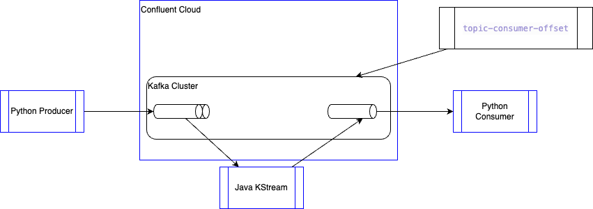
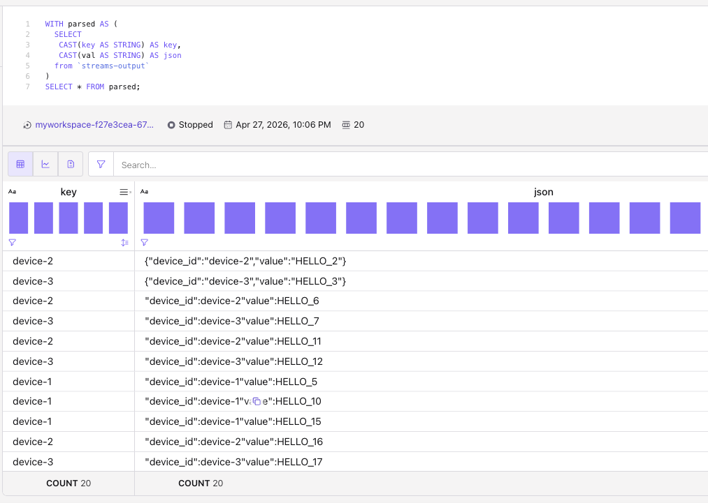
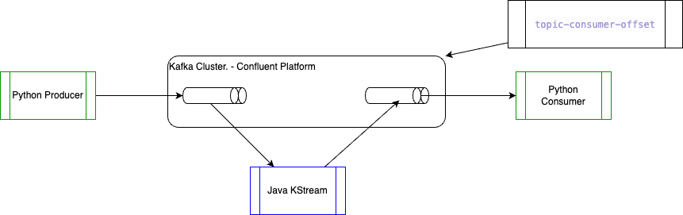

# Research: Kafka consumer groups per topic & committed offsets (Python)

## Intent

This project explores how to answer “which consumer groups are tied to a topic, and what committed offsets do they have per partition?” using the Kafka **Admin API** from Python, without relying on `kafka-consumer-groups` shell loops alone.

For kafka producer, consumer and CLI, the project uses (`uv`), usable against Confluent Cloud (API keys in `.env`) or a local broker ([`docker-compose.yaml`](docker-compose.yaml), KRaft, PLAINTEXT), and to complement ops tooling: see [Why not only `kafka-consumer-groups`?](#why-not-only-kafka-consumer-groups--describe).

There is also a Java Kafka Stream implementation to see how to migrate an existing solution of `consumer-process-produce` with transaction and exactly-once semantic to a SQL Flink implementation. The following figure illustrates the Confluent Cloud deployment



Deliverables:

- **`topic-consumer-offsets`** — list groups relevant to a topic and print committed (and optionally assigned) offsets; optional `--format json`.
- **`demo-kafka-consumer`** — minimal consumer with auto-commit so you can see a group with real commits next to the lister.
- **`streams-demo-producer`** — produce keyed JSON demo records for five `device_id`s to `streams-input` (pairs with `kstream/` and [`streams-handoff/`](streams-handoff/README.md)).
- **[`kstream/`](kstream/README.md)** — Java Kafka Streams sample: read JSON payloads, uppercase the `value` field, write out (EOS v2); Maven + local/Confluent docs.
- **[`streams-handoff/`](streams-handoff/README.md)** — walkthrough: stop Streams, read offsets, continue from `specific-offsets` in Flink SQL.

## Problem

Given a Kafka topic, you often need:

1. Which consumer groups relate to that topic (not just every group in the cluster).
2. For each group, the last committed (read-committed / stored) offset per partition — the offsets consumers have committed to Kafka’s `__consumer_offsets` topic.

Kafka’s Admin API does not expose a single RPC such as “list consumer groups by topic”. You derive the answer by combining metadata and consumer-group APIs.

## Tool / CLI approaches

| Approach | Idea | Pros | Cons |
|----------|------|------|------|
| **Committed offsets** | Enumerate groups with `list_consumer_groups`. For each group, call `list_consumer_group_offsets` scoped to `(topic, partition)` for every partition of the topic. | Simple; matches “current committed offset” literally. | Misses consumers that have joined but never committed yet. |
| **Active assignment** | `describe_consumer_groups` and inspect member assignment for your topic. | Finds active readers without commits. | More broker load; larger responses. |

This folder’s script defaults to committed offsets and optionally adds assignment (`--assignment`) so you can union both views.

## Project layout (uv + Java Streams)

- **`pyproject.toml`** — project metadata and dependencies (no `requirements.txt`).
- **`src/kafka_topic_consumer_offsets/`** — package; CLIs: `topic-consumer-offsets`, `demo-kafka-consumer`, `streams-demo-producer` (`uv run`).
- **`kstream/`** — Java Kafka Streams (Maven, EOS); JSON `value` field uppercasing; see [`kstream/README.md`](kstream/README.md).
- **`docker-compose.yaml`** — local KRaft single broker (Confluent `cp-kafka` 8.2.0, no ZooKeeper); see [Local Kafka (Docker)](#local-kafka-docker).
- **`streams-handoff/`** — README + Flink SQL for offset handoff after stopping Kafka Streams ([`streams-handoff/README.md`](streams-handoff/README.md)).

## Demonstration on Confluent Cloud
### Confluent Cloud Setup

* Copy .env.example to .env
  ```sh
  cp .env.example to .env
  ```
* Modify the file for the expected environment variables, then:
  ```sh
  source .env
  ```

* Using confluent cli:
  ```sh
  confluent login
  ```

* Set env end create some topics
  ```sh
  confluent environment use $CC_ENV_ID
  confluent kafka cluster list
  confluent kafka cluster use  lkc-....
  confluent kafka topic create streams-output
  confluent kafka topic create streams-input
  confluent kafka topic list
  ```

**Setup and run** (from this directory):

```bash
uv sync
uv run topic-consumer-offsets --help

# or: uv run python -m kafka_topic_consumer_offsets.topic_consumer_offsets --help
```


### Assess current groups

```sh
uv run topic-consumer-offsets   --topic streams-output
```

Should generate something like:

```sh
topic=streams-output partitions=[0, 1, 2, 3, 4, 5] groups_scanned=1
```

The offset lister only shows groups that have committed positions for the topic’s partitions (unless you pass `--show-all-groups` / `--assignment`). To create a clear example, run a tiny subscribing consumer with auto-commit on, then list offsets for the same topic and group.

1. Run the producer to get 1 message for the 5 devices:
  ```sh
  uv run streams-demo-producer
  # this is the same as
   uv run streams-demo-producer --bootstrap-servers $KAFKA_BOOTSTRAP_SERVERS --topic streams-input --send-per-key 1 --start-seq 1
  ```

2. Run the demo consumer

   ```bash
   uv run demo-kafka-consumer --topic streams-input --group demo-committed-offsets
   ```

   It reads up to five messages (configurable with `--max-messages`), then closes the consumer so offsets are committed to the `__consumer_offsets` topic.

3. List committed offsets for that group and topic:

   ```bash
   uv run topic-consumer-offsets --topic streams-input --show-all-groups
   ```

   You should see `demo-committed-offsets` with `committed=<n>` and `invalid=false` for partitions that were read.

   ```sh
    topic=streams-input partitions=[0, 1, 2, 3, 4, 5] groups_scanned=1
    demo-committed-offsets	p0	committed=None	invalid=True	meta=None
    demo-committed-offsets	p1	committed=1	invalid=False	meta=None
    demo-committed-offsets	p2	committed=1	invalid=False	meta=None
    demo-committed-offsets	p3	committed=None	invalid=True	meta=None
    demo-committed-offsets	p4	committed=1	invalid=False	meta=None
    demo-committed-offsets	p5	committed=2	invalid=False	meta=None
   ```

### Start Kafka Stream processing

Prerequisites: **JDK 17+** and **Apache Maven** (`mvn` on `PATH`).

* Start a new terminal and be sure to export the environment variables
  ```sh
  export KAFKA_BOOTSTRAP_SERVERS=pkc-.....us-west-2.aws.confluent.cloud:9092
  export KAFKA_API_KEY=....
  export KAFKA_API_SECRET=cfl....
  ```

* Then start the Kafka Stream processing
  ```bash
  cd kstream
  mvn -q compile
  mvn -q exec:java
  ```

  You should get a trace like:
  ```sh
  Starting Kafka Streams: appId=kstream-eos-demo in=streams-input out=streams-output bootstrap=pkc-rgm37.us-west-2.aws.confluent.cloud:9092 processing.guarantee=exactly_once_v2
  KafkaStreams state CREATED -> REBALANCING
  KafkaStreams state REBALANCING -> RUNNING
  ```

* Start the consumer in another terminal and stop it, for following tests
 ```sh
 # from  kafka-topic-consumer-offset folder
 uv run demo-kafka-consumer --topic streams-output
 ```

 you should get:
 ```sh
  [1] streams-output p2 @0 value_len=42 value=b'{"device_id":"device-5","value":"HELLO_5"}' key_len=8
  [2] streams-output p4 @0 value_len=42 value=b'{"device_id":"device-1","value":"HELLO_1"}' key_len=8
  [3] streams-output p4 @2 value_len=42 value=b'{"device_id":"device-2","value":"HELLO_2"}' key_len=8
  [4] streams-output p4 @3 value_len=42 value=b'{"device_id":"device-3","value":"HELLO_3"}' key_len=8
  [5] streams-output p0 @0 value_len=42 value=b'{"device_id":"device-4","value":"HELLO_4"}' key_len=8
 ```

* Get the offset per partitions from the input stream
  ```sh
  uv run topic-consumer-offsets   --topic streams-input  
  ```
  
* Stop the kafka stream process.
* In Confluent Console, Worspace cell: start a consumer
  ```sql
  WITH parsed AS (
    SELECT 
    CAST(key AS STRING) AS key,
    CAST(val AS STRING) AS json
    from `streams-output` 
  ) 
  SELECT * FROM parsed;
  ```

  you should see the five first records.

* Send other new records while Kafka streams and Flink transformation are not running. 
  ```sh
  uv run streams-demo-producer --topic streams-input --send-per-key 3 --start-seq 5 
  ```

* Modify the Flink SQL statement with the matching offset. See file [streams-handoff/flink/continue_from_offsets.sql](./streams-handoff/flink/continue_from_offsets.sq)
  ```sql
  INSERT INTO `streams-output`
  WITH parsed AS (
    SELECT 
    key AS key,
    CAST(val AS STRING) AS json
    from `streams-input`  /*+ OPTIONS('scan.startup.mode'='specific-offsets', 'scan.startup.specific-offsets' = 'partition:1,offset:1;partition:2,offset:1;partition:4,offset:1;partition:5,offset:2;') */ 
  )
  select 
    key,
    CAST(CONCAT('"device_id":' , JSON_VALUE(json, '$.device_id'), '"value":',UPPER(JSON_VALUE(json, '$.value'))) AS BYTES)
  FROM parsed
  ```

  and run it, in another workspace cell.

* *Important to note that this is primarily applicable for stateless queries.*

* You should see the new records arriving without duplicate
  

* Which can also being validates with the external kafka consumer:
  ```sh
   uv run demo-kafka-consumer --topic streams-output --group demo-committed-offset --max-messages 30 
  ```

## Source of information

* [Flink Carry-over offsets - product documentation](https://docs.confluent.io/cloud/current/flink/operate-and-deploy/carry-over-offsets.html) for stateless Flink statements. Flink stateful statements need to reprocess from the earliest offset from non-compacted and append mode topic.


---

## Local Kafka (Docker)

Run an isolated KRaft (no ZooKeeper) single broker stack on your machine, using Confluent Platform 8.2 (`confluentinc/cp-kafka:8.2.0`). No cloud credentials. The broker exposes PLAINTEXT to the host on `localhost:9092`.



**Prerequisites:** [Docker](https://docs.docker.com/get-docker/) and Docker Compose (Compose V2: `docker compose`).

1. Start the cluster (from this project directory):

   ```bash
   docker compose -f docker-compose.yaml up -d
   ```

2. Wait until the broker is healthy (optional):

   ```bash
   docker compose -f docker-compose.yaml ps
   ```

3. Create a topic and seed a consumer group (so the tool has something to list). The CLI tools use the internal listener `broker:29092` inside the container; from the host, clients use `localhost:9092`.

   ```bash
   docker-compose exec broker kafka-topics --bootstrap-server broker:29092 \
     --create --if-not-exists --topic demo-topic --partitions 2 --replication-factor 1

   printf "msg1\nmsg2\n" | docker-compose -T broker kafka-console-producer \
     --bootstrap-server broker:29092 --topic demo-topic

   docker-compose exec broker kafka-console-consumer --bootstrap-server broker:29092 \
     --topic demo-topic --group local-smoke --from-beginning \
     --max-messages 2 --timeout-ms 20000
   ```

4. Run this project against the local broker. If every broker in `KAFKA_BOOTSTRAP_SERVERS` / `--bootstrap-servers` is a local host (`localhost`, `127.0.0.1`, `::1`, or `host.docker.internal`), the clients use PLAINTEXT and ignore `KAFKA_API_KEY` / `KAFKA_API_SECRET` (so a Confluent Cloud `.env` and Docker local stack can coexist). For a non-local host that is still PLAINTEXT (e.g. a LAN IP), pass `--local` to force the same behavior.

   ```bash
   uv sync
   uv run topic-consumer-offsets --bootstrap-servers localhost:9092 --topic demo-topic
   # or:  export KAFKA_BOOTSTRAP_SERVERS=localhost:9092
   #      uv run topic-consumer-offsets --topic demo-topic
   # same for: uv run demo-kafka-consumer --topic demo-topic
   ```

5. Stop and remove containers (data is not persisted; topic and groups are lost):

   ```bash
   docker compose -f docker-compose.yaml down
   ```

Ports: broker `9092` on the host (internal `broker:29092` for `docker compose exec` tools). Change the `ports:` section in the compose file if it conflicts with other services.

---

## Confluent Cloud and `.env`

1. Copy `.env.example` to `.env` in this directory (`.env` is gitignored).
2. Set `KAFKA_BOOTSTRAP_SERVERS` to your cluster’s bootstrap (Kafka endpoint, e.g. `...confluent.cloud:9092`).
3. Set `KAFKA_API_KEY` and `KAFKA_API_SECRET` (or `KAFKA_API_SECRETS` as an alias for the secret) from the Confluent Cloud API key in the console.

**Auth note:** the Kafka client does not use an HTTP `Authorization: Bearer …` token. Confluent Cloud’s default cluster access uses SASL_SSL with PLAIN, where the API key is the SASL *username* and the secret is the SASL *password*. The script configures that when both key and secret are present. For local Docker (above), keep the API key variables empty and use `localhost:9092` (PLAINTEXT).

With `.env` loaded, `--bootstrap-servers` is optional; you still must pass `--topic`.

**Example (Confluent Cloud):**

```bash
uv sync
cp .env.example .env   # set Confluent Cloud bootstrap, API key, and secret

uv run topic-consumer-offsets --topic my-topic
```

**More examples** (set `--bootstrap-servers` for local, or use `.env` for cloud as above):

```bash
# Use with local Docker (bootstrap on CLI) or a cluster reachable at localhost:9092
uv run topic-consumer-offsets \
  --bootstrap-servers localhost:9092 \
  --topic my-topic

# Include groups that have partition assignment but maybe no commits yet:
uv run topic-consumer-offsets \
  --bootstrap-servers localhost:9092 \
  --topic my-topic \
  --assignment

# Print every scanned group's offsets, including OFFSET_INVALID (-1001) rows:
uv run topic-consumer-offsets \
  --bootstrap-servers localhost:9092 \
  --topic my-topic \
  --show-all-groups

# Transactional "stable" offsets (mainly relevant for transactional producers):
uv run topic-consumer-offsets \
  --bootstrap-servers localhost:9092 \
  --topic my-topic \
  --require-stable
```

**Output (text):** one line per `(group, partition)` with `committed=` and `invalid=` (true when offset is `OFFSET_INVALID`).

**JSON:** `--format json` for machine-readable rows.

### ACLs

Confluent Cloud: list and describe API calls need appropriate role bindings for the API key. Local Docker uses no ACLs by default (PLAINTEXT; the bundled console tools have full access).

## Why not only `kafka-consumer-groups` / `--describe`?

The Kafka distribution includes `kafka-consumer-groups.sh`. `--describe --group <id>` is the usual way to inspect one group: LAG, committed offset, and partition assignment. You should use it when you already know the group id and have the CLI on `PATH` or inside a broker container.

This project does not replace that workflow; use both for cross-checks (see `notes.md`). The Python tool targets a different convenience:

| | `kafka-consumer-groups --describe` | `uv run topic-consumer-offsets` |
|--|--------------------------------------|----------------------------------|
| **Input** | You pass one `--group` | You pass a topic; groups are discovered against that topic |
| **Environment** | Needs Kafka/Confluent binaries or `docker exec … broker …` | `uv run` + `confluent-kafka` + `.env` (handy for Confluent Cloud without a local Kafka install) |
| **Output** | Text table | Text or `--format json` for scripts/CI |
| **“Groups for topic X”** | No single subcommand: list all groups, then describe each (e.g. shell loop) | One command that scans groups and filters by topic offsets (and optional `--assignment`) |

**Example (local Docker):** compare a known group to this tool’s output:

```bash
docker compose exec broker kafka-consumer-groups --bootstrap-server broker:29092 \
  --describe --group local-smoke
```

## References

- Confluent Kafka Python Admin: `AdminClient.list_consumer_groups`, `list_consumer_group_offsets`, `describe_consumer_groups`, `describe_topics`.
- Internal notes: `notes.md`.
