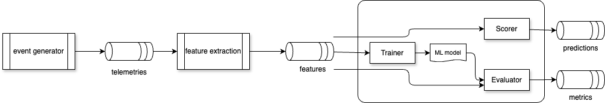

# Reefer predictive maintenance — Kafka stream ML

Research POC: train and evaluate a predictive maintenance classifier for refrigerated units (reefers) when **training, test, and inference telemetry share one Kafka topic** (`reefer.telemetry.v1`). Records are routed by `meta.split`, not by separate topics.

See [SPEC.md](SPEC.md) for the full design.

## Architecture




## Why one topic

Traditional ML pipelines copy data into `train/` and `test/` datasets. In streaming systems, the same logical stream often carries all phases with metadata:

| Logical stream | This POC |
| --- | --- |
| Training stream | `meta.split = train` on `reefer.telemetry.v1` |
| Test stream | `meta.split = test` on the same topic |
| Inference stream | `meta.split = inference` on the same topic |

Device holdout prevents leakage: `reefer_01` and `reefer_02` train; `reefer_03` tests. See `config/generator.yaml`.

## Stack

- Python 3.12+, `uv`
- Kafka KRaft (Confluent Platform 8.2.0) via `docker-compose.yaml`
- scikit-learn `RandomForestClassifier` on windowed features
- **Flink SQL** — tumbling-window feature extraction per `device_id` ([`flink/README.md`](flink/README.md))

## Quick start

```bash
cd research/reefer-predictive-maintenance-kafka
cp .env.example .env
uv sync --group dev
docker compose up -d
```

Wait for the broker healthcheck, then (use `127.0.0.1:9092` in `.env`, not `localhost` — macOS often resolves `localhost` to IPv6 `[::1]`, which Docker may not bind):


```bash
uv run reefer-pm-create-topics
uv run reefer-pm-generate
uv run reefer-pm-train
uv run reefer-pm-evaluate
uv run reefer-pm-score
```

Or run the full demo script:

```bash
./scripts/run_demo.sh
```

### Inspect outputs

```bash
docker compose exec broker kafka-console-consumer \
  --bootstrap-server broker:29092 \
  --topic reefer.ml.metrics.v1 \
  --from-beginning --max-messages 1

docker compose exec broker kafka-console-consumer \
  --bootstrap-server broker:29092 \
  --topic reefer.ml.predictions.v1 \
  --from-beginning
```

### Offline (no Kafka)

```bash
uv run reefer-pm-generate --dry-run
uv run pytest
```

Train/eval/score support `--from-file` with JSONL for tests.

### Flink SQL features (optional)

After `reefer-pm-generate`, deploy the streaming feature job (Confluent Flink workspace or local Flink 2.2+):

See [flink/README.md](flink/README.md).

## Project layout

| Path | Role |
| --- | --- |
| `src/reefer_pm_kafka/generator.py` | Synthetic telemetry producer |
| `src/reefer_pm_kafka/features.py` | Shared windowed features |
| `src/reefer_pm_kafka/train.py` | Train on `split=train` |
| `src/reefer_pm_kafka/evaluate.py` | Metrics on `split=test` |
| `src/reefer_pm_kafka/score.py` | Predictions on `split=inference` |
| `flink/sql/` | Flink SQL: telemetry → windowed features by `device_id` |
| `tests/` | Unit and offline ML tests |

## Consumer groups

Each stage uses its own `group.id` so all read from the beginning independently:

- `reefer-pm-train`
- `reefer-pm-eval`
- `reefer-pm-score`

## Topics

| Topic | Content |
| --- | --- |
| `reefer.telemetry.v1` | Raw JSON telemetry (all splits) |
| `reefer.features.v1` | Windowed features (Flink SQL or Python train) |
| `reefer.ml.metrics.v1` | Evaluation run metrics |
| `reefer.ml.predictions.v1` | Inference predictions |

## Related work

- [flink-studies 12-ai-agents](https://github.com/jbcodeforce/flink-studies/tree/master/code/flink-sql/12-ai-agents/) — reefer temperature anomaly (ARMA), not supervised PM
- [kafka-topic-consumer-offsets](../kafka-topic-consumer-offsets/) — Kafka ops patterns
