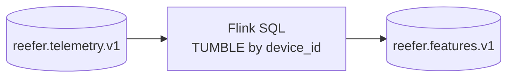

# Flink SQL — windowed feature extraction by `device_id`

Flink SQL reads `reefer.telemetry.v1` (all splits on one topic), computes tumbling-window aggregates **per `device_id`**, and writes rows to `reefer.features.v1`.

This mirrors the Python logic in `src/reefer_pm_kafka/features.py` (see feature column table below).

## Pipeline



| File | Purpose |
| --- | --- |
| [`sql/01_ddl_telemetry_source.sql`](sql/01_ddl_telemetry_source.sql) | Kafka source table (substitute `${BOOTSTRAP_SERVERS}`) |
| [`sql/02_ddl_features_sink.sql`](sql/02_ddl_features_sink.sql) | Kafka sink table |
| [`sql/03_dml_feature_extraction.sql`](sql/03_dml_feature_extraction.sql) | Streaming `INSERT` with `TUMBLE` + `GROUP BY device_id` |
| [`sql/*.local.sql`](sql/) | Same DDL/DML with `127.0.0.1:9092` baked in for local Docker |

## Features (per device, per tumbling window)

| Column | Flink aggregate | Python equivalent |
| --- | --- | --- |
| `avg_return_air_temp_c` | `AVG(return_air_temp_c)` | `np.mean` |
| `std_return_air_temp_c` | `STDDEV_POP(...)` | `np.std` |
| `delta_supply_return_c` | `AVG(supply - return)` | mean delta |
| `slope_return_air_per_min` | min/max rate over window | `np.polyfit` (approximate in SQL) |
| `avg_power_draw_kw` | `AVG(power_draw_kw)` | `np.mean` |
| `max_door_open_count` | `MAX(door_open_count)` | `max` |
| `avg_vibration_rms` | `AVG(vibration_rms)` | `np.mean` |
| `meta_split` | `LAST_VALUE(meta.split)` | last event in window |
| `failure_class` | `LAST_VALUE(label.failure_class)` | majority label in Python |

Default window: **10 seconds** (`INTERVAL '10' SECOND`). Change in `03_dml_*.sql` if `WINDOW_SECONDS` in `.env` differs.

## Prerequisites

1. Topics exist (`reefer-pm-create-topics`).
2. Telemetry published (`reefer-pm-generate`).
3. Flink SQL runtime:
   - **Confluent Cloud** Flink workspace (recommended), or
   - Self-managed Flink 2.2+ with Kafka connector.

## Confluent Cloud Flink

1. Open the Flink SQL workspace for your environment.
2. Set compute pool and run statements in order:
   - Replace `${BOOTSTRAP_SERVERS}` in `01` and `02` with your cluster bootstrap (or use the Console Kafka connection UI).
   - For SASL_SSL, add `properties.security.protocol`, `properties.sasl.mechanism`, and `properties.sasl.jaas.config` to both DDL files (same pattern as [flink-studies `01-kafka-flink`](https://github.com/jbcodeforce/flink-studies/tree/master/code/flink-sql/01-kafka-flink/)).
3. Execute `01_ddl_telemetry_source.sql`, then `02_ddl_features_sink.sql`, then `03_dml_feature_extraction.sql`.
4. Leave the `INSERT` job running (streaming). New telemetry windows will land on `reefer.features.v1`.


## Local Docker Kafka only

No Flink cluster is included in this repo `docker-compose.yaml`. Options:

1. Use **Confluent Cloud Flink** against the local cluster via a tunnel or exposed bootstrap (advanced).
2. Run a local Flink 2.2+ cluster and execute the `*.local.sql` scripts in order via [SQL Client](https://nightlies.apache.org/flink/flink-docs-release-2.2/docs/dev/table/sqlclient/).


## Verify features topic

After the Flink job is running and telemetry is flowing:

```bash
docker compose exec broker kafka-console-consumer \
  --bootstrap-server broker:29092 \
  --topic reefer.features.v1 \
  --from-beginning --max-messages 5
```

Example value (flat JSON):

```json
{
  "device_id": "reefer_01",
  "window_start": "2026-01-15T12:00:00.000Z",
  "window_end": "2026-01-15T12:00:10.000Z",
  "meta_split": "train",
  "failure_class": "healthy",
  "avg_return_air_temp_c": 3.2,
  "std_return_air_temp_c": 0.4,
  "delta_supply_return_c": -1.1,
  "slope_return_air_per_min": 0.05,
  "avg_power_draw_kw": 6.1,
  "max_door_open_count": 1,
  "avg_vibration_rms": 0.18
}
```

## Python ML path vs Flink features

| Path | Feature computation | Topic consumer |
| --- | --- | --- |
| Default | Python `build_feature_rows` in `reefer-pm-train` | Reads `reefer.telemetry.v1` |
| Flink SQL | `03_dml_feature_extraction.sql` | Writes `reefer.features.v1` |

Training still uses Python features by default. A follow-up is to train from Flink-produced flat JSON on `reefer.features.v1` (same column names as `FEATURE_COLUMNS`).

## Stop the job

In Confluent Cloud: cancel the statement / drop the running insert job from the workspace UI.
